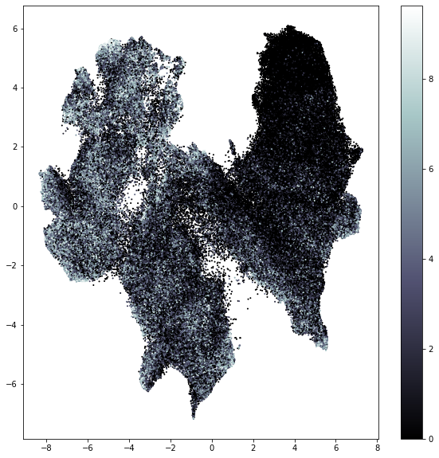

# immunculus
This section is still a draft - more will come later

## Goal
Build a classifier that given a CDR3 amino-acid sequence predicts how frequent this sequence is

## Dataset

TCRseq data from the Emerson et al. 2017 Nat Gen. publication

