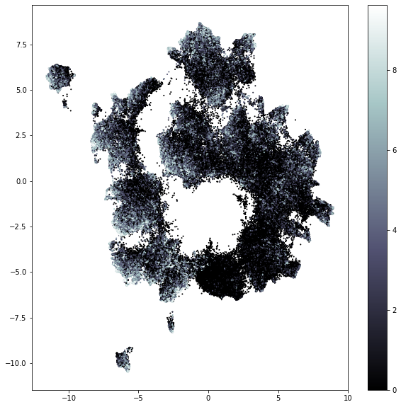

# immunculus
This section is still a draft - more will come later

## Goal
Build a classifier that given a CDR3 amino-acid sequence predicts the likelihood this sequence could be part of either TCR repertoire layers.

## Dataset

TCRseq data from the Britanova et al. 2014 publication

<!---

-->
